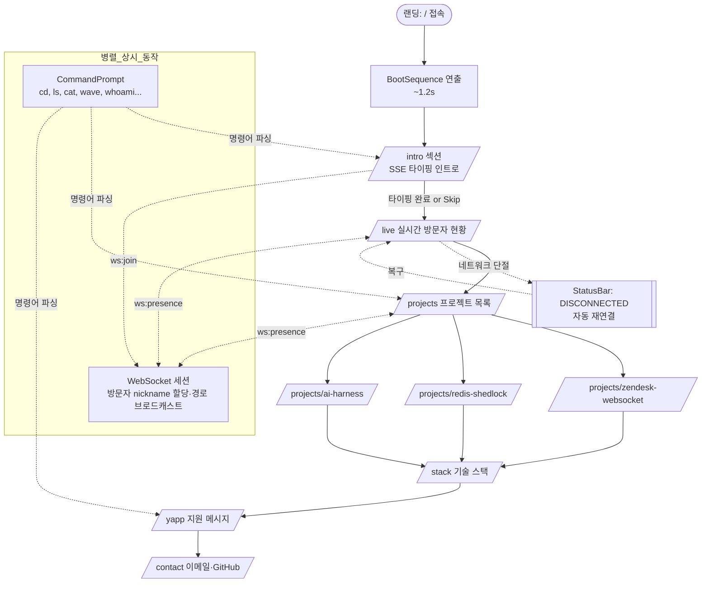

# 화면 설계

> 백엔드 개발자 포트폴리오 (YAPP 지원용) — 터미널 CRT 테마 SPA
>
> 이 문서는 `01_service_overview.md`의 Must/Should Have 범위를 전제로, 컴포넌트 단위까지 내려가는 화면 명세를 담는다. 프론트 구현자는 물론 SSE/WebSocket 엔드포인트를 설계하는 백엔드 개발자가 "어떤 이벤트가 어느 화면 컴포넌트에 꽂히는지"를 한눈에 파악할 수 있도록 작성되었다.

---

## 0. 설계 전제

### 0.1 UI/UX 테마
- **톤앤매너:** CRT 모니터 감성 (scanline overlay, 미세한 flicker, 전원 ON 잔광)
- **컬러 팔레트 (단일 테마, C3는 범위 외):**
  - `--crt-bg: #0A0F0A` (near black)
  - `--crt-green: #33FF66` (주요 텍스트/프롬프트)
  - `--crt-green-dim: #1F9A3D` (보조 텍스트/경계)
  - `--crt-white: #E6FFE6` (강조 텍스트, 하이라이트)
  - `--crt-amber: #FFB000` (LIVE 배지, 경고)
  - `--crt-red: #FF5555` (DISCONNECTED)
- **타이포그래피:** `JetBrains Mono`, fallback `Menlo, Consolas, "D2Coding", monospace`. 기본 14px, 라인하이트 1.5.
- **공간 규칙:** 모든 텍스트는 80컬럼 고정 그리드 기준으로 배치 (ASCII 와이어프레임과 동일). 모바일은 40컬럼으로 축소.

### 0.2 SPA 구조
- Next.js App Router 또는 Vite + React 단일 진입점. **라우트 전환은 URL push만 수행하고 DOM 언마운트는 하지 않는다.** 각 "페이지"는 실제로는 동일 스크롤 컨테이너 내 `<section id="intro">`, `<section id="projects">` 형태로 존재하는 **앵커 섹션**.
- **이동 수단 2가지:**
  1. 스크롤/앵커 클릭 (좌측 사이드 네비 or 상단 프롬프트 내 링크)
  2. 하단 명령어 입력창 (`cd /projects`, `ls`, `cat about.md` 등 — S1)
- URL은 현재 가장 많이 뷰포트를 차지한 섹션에 맞춰 `history.replaceState`로 갱신 (IntersectionObserver 기반).
- 새로고침 시 해당 해시/패스로 자동 스크롤.

### 0.3 공통 레이아웃 (모든 섹션 공유)
```
+------------------------------------------------------------------------------+
|  TopBar: visitor_8@portfolio:~$ <current-path>         [LIVE] 3 online  [?]  |  <- GlobalHeader
+------------------------------------------------------------------------------+
|                                                                              |
|  [ Section Content - 섹션별로 교체 ]                                          |
|                                                                              |
|                                                                              |
+------------------------------------------------------------------------------+
|  StatusBar: uptime 14d 03:22 | ws:OK | last: visitor_5 → /projects 3s ago    |  <- GlobalFooter
+------------------------------------------------------------------------------+
|  $ _                                                               [history] |  <- CommandPrompt (고정)
+------------------------------------------------------------------------------+
```
- `GlobalHeader`, `GlobalFooter`, `CommandPrompt`는 **position: sticky**로 항상 고정.
- 섹션 콘텐츠는 그 사이 스크롤 영역에서 세로로 이어진다.

---

## 1. 사용자 플로우



---

## 2. 전역 컴포넌트 (Global Components)

모든 섹션에서 재사용되는 컴포넌트. 백엔드 관점에서는 **어떤 이벤트가 어느 컴포넌트로 흘러드는지**만 이해하면 충분하다.

### 2.1 `<GlobalHeader />` — 상단 프롬프트 바
- **위치:** `position: sticky; top: 0;` / 높이 40px
- **구성 요소 (좌 → 우):**
  - `PromptLabel` — `visitor_8@portfolio:~` (닉네임은 WebSocket `session/assign` 응답으로 채워짐; S2)
  - `CurrentPath` — `$ /projects` (IntersectionObserver가 감지한 섹션을 반영)
  - `LiveBadge` — `[LIVE] 3 online` (WebSocket `presence:update` 이벤트로 카운트 갱신; M2)
  - `HelpButton` — `[?]` 클릭 시 명령어 치트시트 모달 오픈
- **이벤트 구독:**
  - `ws://.../presence` → `{online: number, me: string}` 수신 시 `LiveBadge`, `PromptLabel` 갱신
- **상태:**
  - `disconnected` 시 `LiveBadge`는 amber→red 블링크, 텍스트 `[DISCONNECTED] retrying...`

### 2.2 `<GlobalFooter />` — 상태 바
- **위치:** `position: sticky; bottom: 40px;` / 높이 24px
- **구성:**
  - `UptimeTicker` — 서버 uptime. 초기값은 `/api/meta` 응답, 이후 클라이언트 setInterval로 +1s
  - `WsStatus` — `ws:OK` / `ws:RETRY(3)` / `ws:DOWN`
  - `LastActivityLog` — `last: visitor_5 → /projects 3s ago` (최근 1건만 노출, 나머지는 `/live`에서)

### 2.3 `<CommandPrompt />` — 명령어 입력창 (S1)
- **위치:** `position: sticky; bottom: 0;` / 높이 40px
- **구성:**
  - `$` 프롬프트 기호 (초록)
  - `<input>` — 자동 포커스. 다른 곳 클릭 후에도 키보드 입력 시 자동 refocus
  - 우측 `[history]` 버튼 — 최근 입력 10개 드롭다운
- **지원 명령어 (파서 테이블):**
  | 명령어 | 동작 | 관련 요구사항 |
  |---|---|---|
  | `cd <path>` | 해당 섹션으로 스크롤 + URL 갱신 | S1 |
  | `ls` | 현재 경로의 하위 섹션 목록 출력 (터미널 로그 영역에 append) | S1 |
  | `cat <file>.md` | 해당 섹션 요약을 로그에 출력 | S1 |
  | `wave` | WebSocket `visitor:wave` 송신 → 전 방문자에게 인사 이펙트 | C1 |
  | `whoami` | 현재 닉네임 + 세션 ID 출력 | C2 |
  | `uptime` | 서버 uptime + 본인 접속 유지 시간 | C2 |
  | `sudo hire-me` | 이스터에그 연출 + `/yapp` 스크롤 | C2 |
  | `clear` | 터미널 로그 영역 비우기 | - |
  | `help` | 명령어 목록 | - |
- **키 바인딩:** `↑/↓` 히스토리, `Tab` 자동완성, `Ctrl+L` clear, `Ctrl+C` 현재 입력 취소.
- **출력 영역:** 명령어 실행 결과는 현재 섹션 바로 위에 append되는 `<TerminalLog />` (자동 스크롤).

### 2.4 `<BootSequence />` — 초기 부팅 연출
- **트리거:** 최초 `/` 진입 시 1회 (sessionStorage 체크)
- **지속 시간:** 약 1.2s
- **내용 (순차 출력):**
```
[    0.00] CRT POWER ON
[    0.12] MemTest.................OK
[    0.34] Connecting to portfolio.api..........OK
[    0.71] Assigning nickname: visitor_8
[    1.02] Opening WebSocket /ws/presence........OK
[    1.15] Boot complete. Press any key.
```
- **연출:** 한 줄당 ~100ms 간격, 마지막 줄 이후 자동으로 `/intro`로 스크롤.
- **Skip:** 아무 키 입력 시 즉시 종료.

### 2.5 `<SideNav />` — 좌측 앵커 네비게이션 (데스크탑만)
- **위치:** 좌측 고정 폭 180px, 모바일에서는 숨김 → 햄버거 대체
- **구성:** 섹션별 아이콘 + 레이블 (`~/intro`, `~/live`, `~/projects`, `~/stack`, `~/yapp`, `~/contact`)
- **현재 섹션 하이라이트:** 초록 배경 + 좌측 `▶` 마커
- **반응형:** ≤ 768px에서 숨김, 대신 `GlobalHeader`에 `[≡]` 버튼 노출

---

## 3. 화면 목록

각 섹션은 SPA의 앵커 섹션이며 URL은 `history.replaceState`로만 갱신된다. "진입 조건"은 "해당 섹션이 뷰포트 중앙에 들어온 시점" 또는 "명령어/링크로 이동한 시점"을 의미한다.

---

### 3.1 [BOOT] 부팅 화면

- **URL:** `/`
- **진입 조건:** 최초 방문 (sessionStorage에 `booted` 플래그 없음)
- **주요 컴포넌트:** `<BootSequence />` (2.4 참조) — 단, `GlobalHeader`/`GlobalFooter`/`CommandPrompt`는 이 단계에서는 **비표시** (부팅 완료 후 fade-in)
- **사용자 액션:**
  - 대기 (1.2s)
  - 또는 아무 키 → Skip
- **다음 화면:** `/intro` (자동 스크롤)
- **와이어프레임:**
```
+------------------------------------------------------------------------------+
|                                                                              |
|                                                                              |
|  [    0.00] CRT POWER ON                                                     |
|  [    0.12] MemTest.................OK                                       |
|  [    0.34] Connecting to portfolio.api..........OK                          |
|  [    0.71] Assigning nickname: visitor_8                                    |
|  [    1.02] Opening WebSocket /ws/presence........OK                         |
|  [    1.15] Boot complete. Press any key.                                    |
|  _                                                                           |
|                                                                              |
|                                                                              |
+------------------------------------------------------------------------------+
```

---

### 3.2 [M1] SSE 타이핑 인트로

**★ 별도 상세 설계는 §4에서 다룬다. 여기서는 섹션 카드 수준만 정의.**

- **URL:** `/intro`
- **진입 조건:** 부팅 완료 직후 자동 진입 / 또는 `cd /intro`
- **주요 컴포넌트:**
  - `<TypingStream />` — SSE `text/event-stream` 구독, 받은 토큰을 DOM에 append (§4)
  - `<SkipButton />` — "press any key to skip" 플로팅 힌트 (S3)
  - `<Caret />` — 타이핑 커서 블링크
- **사용자 액션:**
  - 대기 (자동 타이핑)
  - 아무 키 → Skip (S3), 즉시 전체 본문 표시
  - 스크롤 다운 → `/live`로 이동
- **다음 화면:** `/live`
- **와이어프레임:** §4.2 참조

---

### 3.3 [M2] 실시간 방문자 현황

**★ 별도 상세 설계는 §5에서 다룬다. 여기서는 섹션 카드 수준만 정의.**

- **URL:** `/live`
- **진입 조건:** `/intro` 스크롤 완료 / 또는 `cd /live`
- **주요 컴포넌트:**
  - `<PresenceTable />` — 현재 접속자 목록 (§5)
  - `<ActivityFeed />` — 최근 이벤트 스트림 (S4: 접속 로그)
  - `<ConnectionBadge />` — WebSocket 상태 큰 배지
  - `<WaveFxLayer />` — `wave` 수신 시 잠깐 화면 전체에 `👋` ASCII 이펙트 (C1)
- **사용자 액션:**
  - 목록 관찰
  - 하단 `CommandPrompt`에서 `wave` 입력 (C1)
- **다음 화면:** `/projects`
- **와이어프레임:** §5.2 참조

---

### 3.4 [M3] 프로젝트 목록

- **URL:** `/projects`
- **진입 조건:** 스크롤 / `cd /projects`
- **주요 컴포넌트:**
  - `<SectionHeader title="$ ls /projects" />`
  - `<ProjectCard />` ×3 — 카드별 구조:
    - 헤더: `[PRJ-01] zendesk-websocket` (ID + slug)
    - 3행 요약: `problem:` / `solution:` / `result:`
    - 푸터: `[ read more ↓ ]` 클릭 시 해당 상세 섹션으로 스크롤
  - `<KeyboardNavHint />` — `j/k to move, enter to open` (vim 스타일)
- **사용자 액션:**
  - 카드 클릭 → 상세 섹션으로 스크롤
  - `cd /projects/zendesk-websocket` 등 명령어 이동
  - `j/k` 로 카드 포커스 이동, `Enter` 로 열기
- **다음 화면:** `/projects/<slug>` or `/stack`
- **와이어프레임:**
```
+------------------------------------------------------------------------------+
| visitor_8@portfolio:~$ /projects                         [LIVE] 3 online [?] |
+------------------------------------------------------------------------------+
| $ ls /projects                                                               |
| total 3                                                                      |
|                                                                              |
| +--------------------------------------------------------------------------+ |
| | [PRJ-01] zendesk-websocket                                               | |
| | problem : Zendesk API rate-limit으로 실시간성 깨짐                         | |
| | solution: Polling → WebSocket 양방향 전환, 백프레셔 설계                   | |
| | result  : 평균 지연 8s → 120ms, 호출량 92% 감소                           | |
| |                                                   [ read more ↓ ]        | |
| +--------------------------------------------------------------------------+ |
|                                                                              |
| +--------------------------------------------------------------------------+ |
| | [PRJ-02] redis-shedlock                                                  | |
| | problem : 배치 다중 인스턴스 중복 실행                                     | |
| | solution: Redis + ShedLock 기반 분산 락                                   | |
| | result  : 중복 0건, 스케줄 신뢰도 SLA 99.9% 달성                          | |
| |                                                   [ read more ↓ ]        | |
| +--------------------------------------------------------------------------+ |
|                                                                              |
| +--------------------------------------------------------------------------+ |
| | [PRJ-03] ai-harness                                                      | |
| | problem : 개인 지식 파편화 + 반복작업                                      | |
| | solution: Markdown + Obsidian + Claude Code 오케스트레이션                | |
| | result  : 주간 문서 산출물 3.4배, 반복작업 주 6h 절감                      | |
| |                                                   [ read more ↓ ]        | |
| +--------------------------------------------------------------------------+ |
|                                                                              |
| hint: j/k to move, Enter to open                                             |
+------------------------------------------------------------------------------+
| uptime 14d 03:22 | ws:OK | last: visitor_5 → /projects 3s ago                |
+------------------------------------------------------------------------------+
| $ _                                                               [history]  |
+------------------------------------------------------------------------------+
```
- **반응형:** 모바일에서는 카드 1열, 요약 3행은 유지하되 폰트 12px.

---

### 3.5 [M3-detail] 프로젝트 상세 (×3)

- **URL:** `/projects/zendesk-websocket`, `/projects/redis-shedlock`, `/projects/ai-harness`
- **진입 조건:** 카드 클릭 / 명령어 / 직접 URL
- **주요 컴포넌트:**
  - `<ProjectHeader />` — 프로젝트 메타 (기간, 역할, 스택 태그)
  - `<ProjectBody />` — 문제/가설/해결/결과 4단 섹션. 각 섹션은 `<details>` 접기/펼치기
  - `<AsciiDiagram />` — 선택 프로젝트에 한해 ASCII 시퀀스 다이어그램 (C4). 현재 범위에서는 Zendesk만 포함
  - `<MetricTable />` — 수치형 결과 표 (전/후 비교)
  - `<BackLink />` — `$ cd .. ← back to /projects`
- **사용자 액션:**
  - 다이어그램 내부 스크롤 (좌우)
  - 뒤로가기 (브라우저 back or 명령어 `cd ..`)
- **다음 화면:** `/projects` or `/stack`
- **와이어프레임 (zendesk-websocket 예시):**
```
+------------------------------------------------------------------------------+
| visitor_8@portfolio:~$ /projects/zendesk-websocket       [LIVE] 3 online [?] |
+------------------------------------------------------------------------------+
| $ cat zendesk-websocket.md                                                   |
|                                                                              |
| # PRJ-01 · zendesk-websocket                                                 |
| period: 2023.02 ~ 2023.07   role: Backend   stack: [Java, Spring, WS, Redis] |
|                                                                              |
| ## problem                                                                   |
|   Zendesk REST API rate-limit(분당 700req)으로 실시간 대시보드 지연 평균 8s.  |
|                                                                              |
| ## solution                                                                  |
|   +----------+   subscribe    +----------+   push     +----------+           |
|   |  Client  | <------------> |  Spring  | <--------- | Zendesk  |           |
|   +----------+   WebSocket    |  Gateway |  Webhook   +----------+           |
|                               +----+-----+                                   |
|                                    | backpressure (Redis Stream)             |
|                                    v                                         |
|                               +----------+                                   |
|                               |  Worker  |                                   |
|                               +----------+                                   |
|                                                                              |
| ## result                                                                    |
|   +---------------+---------+---------+                                      |
|   | metric        | before  | after   |                                      |
|   +---------------+---------+---------+                                      |
|   | latency p95   |   8.4 s | 120 ms  |                                      |
|   | api calls/day | 420,000 |  33,600 |                                      |
|   | error rate    |   2.1 % |  0.04 % |                                      |
|   +---------------+---------+---------+                                      |
|                                                                              |
| $ cd .. ← back to /projects                                                  |
+------------------------------------------------------------------------------+
```

---

### 3.6 [M4] 기술 스택

- **URL:** `/stack`
- **진입 조건:** 스크롤 / `cd /stack`
- **주요 컴포넌트:**
  - `<StackGroup />` — 그룹별 카테고리 (Language / Framework / Data / Infra / Collab)
  - `<StackTag />` — 태그 칩. 숙련도 3단계 `***` / `**` / `*`
  - `<StackLegend />` — 숙련도 범례
- **사용자 액션:** 태그 호버 시 tooltip으로 "사용 맥락 한 줄" 노출
- **다음 화면:** `/yapp`
- **와이어프레임:**
```
+------------------------------------------------------------------------------+
| $ cat /stack/summary.txt                                                     |
|                                                                              |
| [Language]      Java *** | Kotlin ** | TypeScript *                          |
| [Framework]     Spring Boot *** | Spring Batch ** | JPA/Hibernate ***        |
| [Data]          MySQL *** | Redis *** | PostgreSQL ** | Elasticsearch *      |
| [Infra]         Docker ** | AWS(EC2,S3,RDS) ** | Jenkins ** | GitHub Actions*|
| [Collab]        Git *** | Jira/Confluence *** | Slack *** | Obsidian **      |
|                                                                              |
| legend: *** fluent   ** production-ready   * learning                        |
+------------------------------------------------------------------------------+
```

---

### 3.7 [M5] YAPP 지원 메시지

- **URL:** `/yapp`
- **진입 조건:** 스크롤 / `cd /yapp` / 이스터에그 `sudo hire-me`
- **주요 컴포넌트:**
  - `<LetterHeader />` — `From: visitor_8` / `To: YAPP 운영진`
  - `<LetterBody />` — 지원 메시지 본문 (마크다운 → HTML 렌더)
  - `<SignatureBlock />` — `-- 장민석 (msjang.dev@gmail.com)`
  - `<ScrollToTopBtn />` — `$ cd ~` 상단 복귀
- **사용자 액션:** 읽기, 이메일 링크 클릭 (→ `/contact`)
- **다음 화면:** `/contact`
- **와이어프레임:**
```
+------------------------------------------------------------------------------+
| $ cat /yapp/letter.md                                                        |
|                                                                              |
| From: visitor_8                                                              |
| To  : YAPP 운영진 귀하                                                       |
| Subj: 왜 YAPP인가                                                            |
| ---------------------------------------------------------------------------- |
|                                                                              |
|   (본문: 지원 동기, 기여 의지, 기대하는 것 — 3~5 문단)                         |
|                                                                              |
|   ...                                                                        |
|                                                                              |
| -- 장민석                                                                    |
|    msjang.dev@gmail.com                                                      |
|                                                                              |
| $ cd ~ (top)                                                                 |
+------------------------------------------------------------------------------+
```

---

### 3.8 [Contact] 연락처

- **URL:** `/contact`
- **진입 조건:** 스크롤 / `cd /contact`
- **주요 컴포넌트:**
  - `<ContactList />` — 이메일, GitHub, (선택) LinkedIn
  - `<QrBlock />` — 이메일 mailto QR (모바일에서 유용)
- **사용자 액션:** 외부 링크 이동
- **다음 화면:** 없음 (최하단). 우측 하단 `$ cd ~` 버튼으로 상단 복귀.
- **와이어프레임:**
```
+------------------------------------------------------------------------------+
| $ cat /contact/index                                                         |
|                                                                              |
|   email  : msjang.dev@gmail.com      [copy]                                  |
|   github : github.com/<handle>       [open]                                  |
|   blog   : (optional)                                                        |
|                                                                              |
|   [ ░░░░░░  QR  ░░░░░░ ]                                                     |
|                                                                              |
| $ cd ~                                                                       |
+------------------------------------------------------------------------------+
```

---

### 3.9 [Modal] 명령어 치트시트 (Help)

- **URL:** URL 변경 없음 (쿼리 `?help=1`만 추가)
- **진입 조건:** `GlobalHeader`의 `[?]` 클릭 / `help` 명령어 / `?` 키
- **주요 컴포넌트:**
  - 모달 컨테이너 (CRT 테두리, dim overlay)
  - 명령어 테이블 (2.3 참조)
  - 닫기 `[ esc ]`
- **사용자 액션:** Esc / 바깥 클릭 / 다시 `[?]`
- **모달/페이지 구분:** **모달** (DOM은 body portal)

---

### 3.10 [Error] 연결 끊김 오버레이

- **URL:** URL 변경 없음
- **진입 조건:** WebSocket `close` or 연속 `ping` timeout 2회
- **주요 컴포넌트:**
  - `<ReconnectOverlay />` — 상단에 얇은 적색 띠 + 우측 재시도 카운터
  - `GlobalFooter.WsStatus` → `ws:RETRY(n)`
- **사용자 액션:** 수동 `[retry now]` 버튼 클릭 가능
- **다음 화면:** 복구 시 자동 해제, `ActivityFeed`에 `[RECONNECTED] as visitor_8` append
- **와이어프레임:**
```
+------------------------------------------------------------------------------+
| !! [DISCONNECTED] retrying (3)...                        [ retry now ]       |
+------------------------------------------------------------------------------+
| (본문 컨텐츠는 그대로 유지됨, 단 WebSocket 의존 컴포넌트는 stale 표시)         |
```

---

## 4. [집중 설계] SSE 타이핑 인트로 `/intro`

> 이 섹션은 "백엔드가 토큰을 하나씩 밀어내는 것처럼 보이는 UX"를 어떻게 화면에서 구성하는지를 상세히 기술한다.

### 4.1 화면 구성
- **목표:** 자기소개 ~12줄을 한 글자씩 타이핑되듯 보여주되, 그 출처가 **진짜 서버 스트림**임을 느끼게 한다.
- **엔드포인트:** `GET /api/intro/stream` (Content-Type: `text/event-stream`).
- **이벤트 페이로드 스키마 (클라이언트 관점):**
  ```
  event: token      data: {"t": "안"}
  event: token      data: {"t": "녕"}
  event: newline    data: {}
  event: section    data: {"id": "name"}      // 섹션 스위칭
  event: done       data: {"durationMs": 9120}
  ```

### 4.2 와이어프레임
```
+------------------------------------------------------------------------------+
| visitor_8@portfolio:~$ /intro                            [LIVE] 3 online [?] |
+------------------------------------------------------------------------------+
| $ cat about.md                                                               |
|                                                                              |
|   > Initializing JMS's portfolio..._                                         |
|                                                                              |
|   name    : 장민석 (Jang Min-seok)                                           |
|   role    : Backend Engineer                                                 |
|   career  : idsTrust (22.11~23.10) → 소프트퍼즐 (24.12~present)              |
|   focus   : 실시간 시스템, 분산락, AI 생산성 하네스                            |
|   moti    : "보여주지 말고 증명하라" —                                        |
|             이 사이트의 모든 실시간 동작은 제가 쓰는 도구의 증명입니다._       |
|                                                                              |
| [ press any key to skip ▶ ]                                                  |
+------------------------------------------------------------------------------+
| uptime 14d 03:22 | sse:streaming (chunk 142/ ?) | ws:OK                      |
+------------------------------------------------------------------------------+
| $ _                                                               [history]  |
+------------------------------------------------------------------------------+
```

### 4.3 컴포넌트 트리
```
<IntroSection>
 ├── <SectionHeader text="$ cat about.md" />
 ├── <TypingStream>
 │    ├── <StreamLineRenderer>   // 현재 타이핑 중인 라인
 │    │    ├── <TypedText />     // 확정된 글자들
 │    │    └── <Caret />         // 블링크 커서 "▊"
 │    └── <CompletedLines />     // 이미 완료된 라인들 (ul)
 ├── <SkipHint />                // "press any key to skip"
 └── <StreamDebugBadge />        // StatusBar에 노출될 chunk 카운터 (개발자 독자용)
```

### 4.4 이벤트 → 컴포넌트 매핑
| SSE 이벤트 | 수신 컴포넌트 | DOM 동작 |
|---|---|---|
| `event: token` | `<StreamLineRenderer>` | `<TypedText>`의 innerText에 `data.t` append |
| `event: newline` | `<TypingStream>` | 현재 라인을 `<CompletedLines>`로 이동, 새 라인 시작 |
| `event: section` | `<IntroSection>` | 섹션 키를 dataset에 기록 (스킵 시 사용) |
| `event: done` | `<IntroSection>` | `<SkipHint>` 제거, 자동 스크롤 `/live` |
| `event: error` / stream close | `<IntroSection>` | 부분 텍스트 유지 + 하단에 `[stream closed, click to retry]` |

### 4.5 Skip 동작 (S3)
- 트리거: `keydown` (input 제외), 화면 탭/클릭, `<SkipHint>` 클릭
- 처리:
  1. EventSource `close()` 호출
  2. 서버에 `POST /api/intro/skip` (선택; 지표 수집용)
  3. 전체 스크립트(프리페치한 정적 fallback)를 일괄 렌더
  4. 0.3s 후 `/live`로 부드럽게 스크롤

### 4.6 접근성
- `aria-live="polite"` 를 `<TypingStream>`에 부여 — 스크린리더는 완료된 라인 단위로만 읽음.
- prefers-reduced-motion 사용자는 SSE 연결 없이 즉시 전체 텍스트 노출.

### 4.7 반응형 (S5)
- 80컬럼 → 40컬럼 축소. 긴 문장은 softwrap. 스킵 힌트는 모바일에서 `tap to skip` 으로 문구 교체.

---

## 5. [집중 설계] WebSocket 실시간 방문자 현황 `/live`

> "지금 같은 사이트를 보고 있는 사람"을 정면으로 드러내는 핵심 섹션. 이 섹션이 잘 돌아가면 모든 "살아있는 시스템" 메시지가 증명된다.

### 5.1 화면 구성 원칙
- 좌측 2/3: **접속자 목록 표** (PresenceTable)
- 우측 1/3: **실시간 이벤트 피드** (ActivityFeed, S4)
- 상단: 큰 `<ConnectionBadge />`
- `CommandPrompt`에서 `wave` 입력 시 전체 화면에 ASCII 웨이브 이펙트 (C1)

### 5.2 와이어프레임 (데스크탑)
```
+------------------------------------------------------------------------------+
| visitor_8@portfolio:~$ /live                             [LIVE] 3 online [?] |
+------------------------------------------------------------------------------+
|                                                                              |
|   ┌─ CONNECTION ──────────────────────────────────────────────────────────┐  |
|   │  [LIVE]  connected as visitor_8   since 00:02:14   latency 38ms       │  |
|   └───────────────────────────────────────────────────────────────────────┘  |
|                                                                              |
|   ┌─ PRESENCE (3 online) ──────────────────┐  ┌─ ACTIVITY ──────────────┐    |
|   │ nickname     path                 idle │  │ 00:00:03 visitor_5 join  │   |
|   │ ----------- ----------------- -------- │  │ 00:00:07 visitor_5 →/prj │   |
|   │ ▶ visitor_8 /live              0s  (me)│  │ 00:00:41 visitor_7 →/stk │   |
|   │   visitor_7 /projects/..shedlk 12s     │  │ 00:01:02 visitor_8 join  │   |
|   │   visitor_5 /projects          3s      │  │ 00:02:14 visitor_8 →/liv │   |
|   │                                        │  │ 00:02:20 visitor_5 wave  │   |
|   │                                        │  │ ...                      │   |
|   └────────────────────────────────────────┘  └─────────────────────────┘    |
|                                                                              |
|   hint: type `wave` below to say hi to everyone                              |
+------------------------------------------------------------------------------+
| uptime 14d 03:22 | ws:OK (hb 2s) | last: visitor_5 wave 1s ago               |
+------------------------------------------------------------------------------+
| $ _                                                               [history]  |
+------------------------------------------------------------------------------+
```

### 5.3 컴포넌트 트리
```
<LiveSection>
 ├── <ConnectionBadge />
 ├── <PresenceTable>
 │    ├── <PresenceRow isMe />       // 본인은 ▶ 마커 + (me) 라벨
 │    └── <PresenceRow />*
 ├── <ActivityFeed>
 │    └── <ActivityLine />*          // append-only, 최대 50건 버퍼
 ├── <WaveHint />
 └── <WaveFxLayer />                 // 글로벌 overlay
```

### 5.4 WebSocket 프로토콜 (클라이언트가 소비하는 관점)
- **엔드포인트:** `wss://.../ws/presence`
- **수신 이벤트:**
  | event | payload 예시 | 갱신 대상 |
  |---|---|---|
  | `session.assigned` | `{nickname:"visitor_8", sid:"abc"}` | `GlobalHeader.PromptLabel`, `ConnectionBadge` |
  | `presence.snapshot` | `{users:[{nick,path,sinceMs}...]}` | `PresenceTable` 전체 rehydrate |
  | `presence.join` | `{nick, path}` | `PresenceTable` row insert + `ActivityFeed` append |
  | `presence.leave` | `{nick}` | row remove + feed append |
  | `presence.move` | `{nick, path}` | row `path` 업데이트 + feed append |
  | `visitor.wave` | `{from}` | `WaveFxLayer` trigger + feed append (C1) |
  | `server.heartbeat` | `{uptimeMs}` | `GlobalFooter.UptimeTicker` 동기화 |
- **송신 이벤트 (클라이언트 → 서버):**
  | event | 트리거 | payload |
  |---|---|---|
  | `client.pathChange` | IntersectionObserver가 섹션 바뀜 감지 | `{path}` |
  | `client.wave` | `wave` 명령어 | `{}` |
  | `client.pong` | heartbeat 응답 | `{}` |

### 5.5 연결 상태 머신
```
 [INIT] --handshake OK--> [CONNECTED] --ping miss x2--> [RETRYING(n)]
    ^                          |                              |
    |                          | tab hidden > 30s             |
    |                       [IDLE]                           (n>=5)
    |                          |                              |
    +--------resume------------+                              v
                                                          [DEAD]
                                                          (사용자 수동 retry 버튼만 가능)
```
- `CONNECTED` → `RETRYING` 진입 시 §3.10 오버레이 즉시 표시.
- 재접속 성공 시 서버로부터 **새로운 nickname**을 받을 수 있음 → `GlobalHeader` 및 `PresenceTable(me)`에 반영되며 `ActivityFeed`에 `[RECONNECTED] as visitor_X` append (시나리오 3 대응).

### 5.6 `PresenceTable` 상세
- **행 구조:** `[marker] nickname | path | idle`
- **정렬:** 최근 활동 순 desc, 본인은 항상 최상단 고정
- **idle 계산:** `now - lastMoveAt` (클라이언트에서 1s tick)
- **상호작용:**
  - 행 클릭 시 해당 경로로 자신도 이동 ("그 사람이 보고 있는 곳 따라가기")
  - 오른쪽 끝 `(me)` 배지는 본인 구분용

### 5.7 `ActivityFeed` 상세 (S4: 접속 로그 히스토리)
- **버퍼:** 클라이언트 메모리 최대 50건, 초과 시 상단부터 drop
- **최초 진입 시:** 서버가 `presence.snapshot` 시 `recentLogs: [...]` 를 함께 내려 최근 N건(N=20) 복원
- **포맷:** `hh:mm:ss visitor_X join|leave|→/path|wave`
- **색상:** join=green, leave=dim, move=white, wave=amber

### 5.8 `wave` 이펙트 (C1)
- `visitor.wave` 수신 시 `WaveFxLayer`에 2초간 가운데에 떠 있는 큼직한 ASCII:
```
    ____               _            _
   / ___| _ __   ___  | | ___ __  _| | __
   \___ \| '_ \ / _ \ | |/ / '_ \(_) |/ _\ 
    ___) | | | |  __/ |   <| |_) | | | (_|
   |____/|_| |_|\___| |_|\_\ .__/|_|_|\__|
                           |_|   visitor_5 says hi
```
- 2초 후 fade-out. 동시 다수 이벤트는 queue로 1초 간격 재생.

### 5.9 장애 UX (시나리오 3)
1. `ws close` 감지 → `ConnectionBadge` 색상 red, 텍스트 `[DISCONNECTED] retrying (n)`
2. `PresenceTable`은 stale 표시 (opacity 0.4 + `stale` 배지)
3. 지수 백오프 (1s → 2s → 4s → 8s, max 8s)
4. 복구 성공 시 snapshot rehydrate + feed에 `[RECONNECTED]` append, `WaveFxLayer`는 자동 재생 안 함

### 5.10 반응형 (S5)
- ≤ 768px: PresenceTable / ActivityFeed 2단 → 1단 세로 스택. ActivityFeed 최대 높이 240px + 자체 스크롤.
- 명령어 입력창은 항상 하단 고정 유지.

---

## 6. 반응형 정책 요약

| 화면폭 | 레이아웃 변경 |
|---|---|
| ≥ 1280px | 기본 80컬럼 + `SideNav` 노출 |
| 768–1279px | `SideNav` 숨김, 햄버거로 대체. 80컬럼 유지 |
| < 768px | 40컬럼 축소. 카드/테이블 1단 스택. ASCII 다이어그램은 가로 스크롤 |
| < 768px landscape | `CommandPrompt` 높이 32px로 축소 |

---

## 7. 모달/페이지 분리 요약

| 화면 | 분리 방식 | 이유 |
|---|---|---|
| Boot Sequence | 임시 overlay (최초 1회) | 본 콘텐츠와 분리된 연출 |
| Intro / Live / Projects / Stack / YAPP / Contact | SPA 앵커 섹션 | 스크롤 흐름 보존 |
| Projects 상세 ×3 | SPA 앵커 섹션 (별도 URL 매핑) | 공유 URL 필요 |
| Help Cheatsheet | **모달** | 컨텍스트 유지하며 빠른 참조 |
| Disconnect Overlay | **오버레이 띠** | 본문 접근 차단하지 않고 경고 |

---

## 8. 백엔드 관점 구현 체크리스트

설계 검토 시 백엔드 개발자가 바로 확인할 체크리스트. 구현 착수 시점에 각 항목을 엔드포인트로 매핑한다.

- [ ] `GET /api/meta` — uptime, commitSha, boot시각
- [ ] `GET /api/intro/stream` — SSE, token/newline/section/done 이벤트 송출 (§4.1)
- [ ] `POST /api/intro/skip` — 지표 수집 (선택)
- [ ] `WS /ws/presence` — §5.4 프로토콜 전체
- [ ] `GET /api/projects` — 3건 + 각 detail JSON (정적 파일로 대체 가능)
- [ ] `GET /api/activity/recent?limit=20` — 초기 `ActivityFeed` hydrate용 (또는 `presence.snapshot`에 inline)
- [ ] 보안: nickname은 서버 세션 바인딩, 클라이언트에서 바꾸지 못함 / wave에 per-session rate limit (예: 5회/분)
- [ ] 관측: 연결 수, reconnect 비율, intro skip rate를 메트릭으로 export

---

## 9. 명세 간 추적성 (Requirement → Screen)

| 요구사항 | 대응 섹션/컴포넌트 |
|---|---|
| M1 SSE 타이핑 인트로 | §4 전체, `<TypingStream/>` |
| M2 실시간 방문자 커서 | §5 전체, `<PresenceTable/>`, `<GlobalHeader.LiveBadge/>` |
| M3 프로젝트 목록/상세 | §3.4, §3.5 |
| M4 기술 스택 | §3.6 |
| M5 YAPP 지원 메시지 | §3.7 |
| M6 터미널 UI 테마 | §0.1, 공통 레이아웃, 모든 섹션 |
| S1 명령어 네비게이션 | §2.3 `<CommandPrompt/>` |
| S2 방문자 닉네임 자동 할당 | §5.4 `session.assigned` → `<GlobalHeader/>` |
| S3 타이핑 스킵 | §4.5 |
| S4 접속 로그 히스토리 | §5.7 `<ActivityFeed/>` |
| S5 모바일 반응형 | §6 |
| C1 wave 반응 | §5.8 `<WaveFxLayer/>` |
| C2 이스터에그 | §2.3 명령어 표 |
| C4 ASCII 시퀀스 다이어그램 | §3.5 Zendesk 상세 |

---

(끝)
