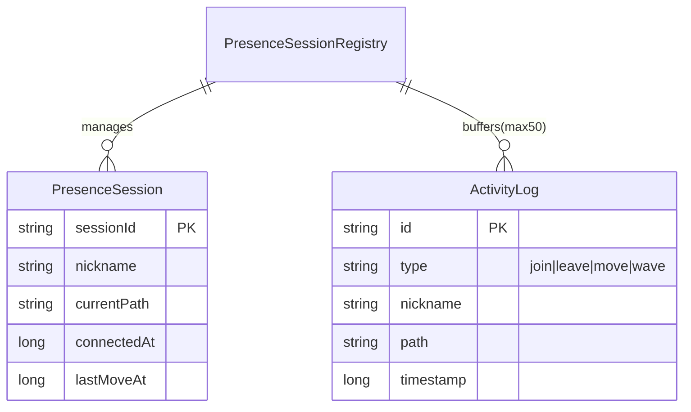

# 기술 명세

> 입력: `02_screen_design.md` §4 (SSE), §5 (WebSocket), §8 (백엔드 체크리스트)

---

## 1. 기술 스택

| 영역 | 기술 | 선정 이유 |
|------|------|----------|
| **Backend** | Spring Boot 3.x + **Kotlin** | 이 프로젝트에서 Kotlin 찍먹. Java 상호운용 가능, 코루틴으로 SSE 비동기 처리 자연스럽게 연결 |
| **SSE** | Spring MVC `SseEmitter` (또는 Kotlin coroutine Flow) | 내장, 토큰 스트리밍에 충분 |
| **WebSocket** | Spring WebSocket + STOMP over SockJS | SockJS 폴백 처리, STOMP pub/sub 구조화 |
| **Pub/Sub** | In-memory `SimpMessagingTemplate` | 단일 인스턴스 기준. 확장 시 Redis Pub/Sub으로 교체 |
| **Frontend** | React + TypeScript + Vite | Vercel 배포 최적화, 빠른 HMR |
| **Styling** | Tailwind CSS + CSS Variables | CRT 컬러 팔레트 토큰 관리 |
| **Font** | JetBrains Mono (Google Fonts CDN) | monospace 터미널 느낌 |
| **Deploy (FE)** | Vercel | 무료 티어, 자동 CI/CD |
| **Deploy (BE)** | 맥미니 (홈 서버) + Docker + Nginx reverse proxy | 이미 보유한 인프라 활용, Railway 비용 없음. DDNS 또는 고정 IP 필요 |
| **DB** | 없음 (stateless) | 방문자 데이터는 세션 메모리만 사용, 영속화 불필요 |

---

## 2. 시스템 아키텍처

```
                ┌─────────────────────────────────────┐
                │           Vercel (Frontend)          │
                │  React SPA                           │
                │  ┌──────────┐  ┌─────────────────┐  │
                │  │EventSource│  │ STOMP over       │  │
                │  │(SSE)     │  │ SockJS(WebSocket)│  │
                └──┴────┬─────┴──┴────────┬──────────┘
                        │                 │
              HTTPS/SSE │                 │ WSS
                        ▼                 ▼
                ┌─────────────────────────────────────┐
                │         맥미니 홈 서버 (Backend)            │
                │  Spring Boot 3.x                     │
                │                                      │
                │  ┌──────────────┐  ┌─────────────┐  │
                │  │ SSE Controller│  │  WebSocket  │  │
                │  │ /api/intro   │  │  Handler    │  │
                │  │ /stream      │  │  /ws/       │  │
                │  └──────────────┘  │  presence   │  │
                │                    └──────┬──────┘  │
                │                           │         │
                │  ┌────────────────────────▼──────┐  │
                │  │  PresenceSessionRegistry       │  │
                │  │  (ConcurrentHashMap,           │  │
                │  │   session → {nick, path, time})│  │
                │  └───────────────────────────────┘  │
                │                                      │
                │  ┌───────────────────────────────┐  │
                │  │  IntroScriptService            │  │
                │  │  (텍스트 토큰 배열 → SseEmitter)│  │
                │  └───────────────────────────────┘  │
                └─────────────────────────────────────┘
```

---

## 3. API 명세

### 3.1 `GET /api/meta`

- **설명:** 서버 uptime, 버전 정보 반환 (부팅 시 한 번 호출)
- **Response:**
  ```json
  {
    "uptimeMs": 1234567,
    "version": "1.0.0",
    "bootAt": "2026-04-20T09:00:00Z"
  }
  ```

---

### 3.2 `GET /api/intro/stream`

- **설명:** SSE 스트림. 자기소개 텍스트를 토큰 단위로 push
- **Content-Type:** `text/event-stream; charset=UTF-8`
- **이벤트 스키마:**
  ```
  event: token
  data: {"t": "장"}

  event: newline
  data: {}

  event: done
  data: {"durationMs": 9200}
  ```
- **구현 포인트:**
  - `SseEmitter` timeout = 30s (평균 소요시간 ~10s 대비 여유)
  - 토큰 간 delay: 30~60ms (글자 타이핑 느낌)
  - 줄 끝 `newline` 이벤트 후 500ms 정지 (문장 호흡)
  - `event: done` 후 emitter `complete()`
- **에러:** 클라이언트 disconnect 시 `SseEmitter.completeWithError()` 호출, 스레드 정리

---

### 3.3 `POST /api/intro/skip`

- **설명:** 스킵 이벤트 수집 (선택, 지표용)
- **Request:** 없음
- **Response:** `204 No Content`

---

### 3.4 WebSocket `/ws/presence`

- **프로토콜:** STOMP over SockJS
- **연결 엔드포인트:** `/ws/presence`
- **STOMP 구독 경로:** `/topic/presence`

#### 서버 → 클라이언트 이벤트

| STOMP destination | event 필드 | payload 예시 |
|---|---|---|
| `/topic/presence` | `session.assigned` | `{"nick":"visitor_8","sid":"abc123"}` |
| `/topic/presence` | `presence.snapshot` | `{"users":[...],"recentLogs":[...]}` |
| `/topic/presence` | `presence.join` | `{"nick":"visitor_3","path":"/intro"}` |
| `/topic/presence` | `presence.leave` | `{"nick":"visitor_3"}` |
| `/topic/presence` | `presence.move` | `{"nick":"visitor_3","path":"/projects"}` |
| `/topic/presence` | `visitor.wave` | `{"from":"visitor_3"}` |
| `/topic/presence` | `server.heartbeat` | `{"uptimeMs":1234567}` |

#### 클라이언트 → 서버 이벤트

| STOMP destination | event 필드 | payload |
|---|---|---|
| `/app/presence/path` | `client.pathChange` | `{"path":"/projects"}` |
| `/app/presence/wave` | `client.wave` | `{}` |
| `/app/presence/pong` | `client.pong` | `{}` |

#### Rate Limit
- `wave`: 세션당 5회/분. 초과 시 서버가 무시 (클라이언트에 에러 없음)
- `pathChange`: throttle 500ms (클라이언트 IntersectionObserver 발화 빈도 제한)

---

### 3.5 `GET /api/projects`

- **설명:** 프로젝트 목록 (정적 JSON, 빌드 시 로드)
- **Response:**
  ```json
  [
    {
      "slug": "zendesk-websocket",
      "title": "Zendesk Rate Limit → WebSocket 전환",
      "summary": {"problem":"...", "solution":"...", "result":"..."},
      "period": "2023.02 ~ 2023.07",
      "stack": ["Java", "Spring Boot", "WebSocket", "Redis"],
      "metrics": [
        {"label":"latency p95","before":"8.4s","after":"120ms"},
        {"label":"api calls/day","before":"420,000","after":"33,600"},
        {"label":"error rate","before":"2.1%","after":"0.04%"}
      ]
    }
  ]
  ```

---

## 4. 데이터 모델

영속 DB 없음. 서버 메모리에만 존재하는 런타임 객체.



- `PresenceSessionRegistry`: `ConcurrentHashMap<String, PresenceSession>`
- `ActivityLog` 버퍼: `ArrayDeque<ActivityLog>` (max 50, 초과 시 head drop)
- 서버 재시작 시 전체 초기화 (휘발성 의도적 유지)

---

## 5. 비기능 요건

### 성능
- SSE: 동시 연결 최대 100개 기준. Spring MVC 기본 스레드풀(200)로 충분
- WebSocket: 동시 접속자 수 상시 50 이하로 가정 (포트폴리오 특성)
- heartbeat 주기: 10s (서버 idle 연결 유지)

### 보안
- Nickname은 서버가 UUID 앞 8자리로 할당, 클라이언트가 변경 불가
- CORS: Vercel 배포 도메인만 허용 (`allowedOrigins`)
- Wave rate limit: 세션당 5회/분 (서버 side throttle)
- 프로젝트 데이터는 읽기 전용 정적 JSON, 쓰기 엔드포인트 없음

### 확장성
- 현재: 단일 인스턴스 (맥미니)
- 수평 확장 시: `PresenceSessionRegistry`를 Redis Pub/Sub 기반으로 교체 (인터페이스 분리로 구조 준비)
- SSE/WebSocket 상태가 메모리에만 있으므로 로드밸런서 사용 시 sticky session 필요

### 관측 (Observability)
- Spring Boot Actuator `/actuator/health`, `/actuator/metrics` 노출
- 커스텀 메트릭: `ws.connections.active`, `sse.intro.completions`, `sse.intro.skips`
- Docker 로그 스트림으로 충분 (별도 APM 미사용)

---

## 6. 인프라 구성

### 배포 환경

| 항목 | Frontend | Backend |
|------|----------|---------|
| 플랫폼 | Vercel (Hobby) | 맥미니 홈 서버 |
| 비용 | 무료 | 전기세만 |
| 도메인 | `*.vercel.app` | DDNS 또는 고정 IP + Nginx |
| HTTPS/WSS | 자동 | Let's Encrypt + Nginx SSL 종단 |
| 배포 방식 | GitHub push → 자동 빌드 | Docker 이미지 빌드 → `docker compose up -d` |
| 환경변수 | `VITE_API_BASE_URL`, `VITE_WS_URL` | `.env` 파일 (맥미니 로컬) |

### 맥미니 서버 구성

```
[맥미니]
  ├── Docker
  │    └── portfolio-api (Spring Boot JAR, 포트 8080)
  └── Nginx (리버스 프록시)
       ├── /api/    → localhost:8080
       ├── /ws/     → localhost:8080 (WebSocket upgrade 헤더 필요)
       └── HTTPS    → Let's Encrypt 인증서 (certbot)
```

**Nginx WebSocket 프록시 필수 설정:**
```nginx
location /ws/ {
    proxy_pass http://localhost:8080;
    proxy_http_version 1.1;
    proxy_set_header Upgrade $http_upgrade;
    proxy_set_header Connection "upgrade";
}
```

### CI/CD

```
GitHub push (main)
  ├── Vercel: npm run build → CDN 배포 (자동)
  └── 맥미니: git pull → ./gradlew bootJar → docker compose up -d (수동 or webhook)
```

### 개발 환경

- 로컬: `./gradlew bootRun` (BE 8080) + `npm run dev` (FE)
- FE `vite.config.ts` proxy: `/api`, `/ws` → `localhost:8080`

---

## 7. 구현 우선순위 (바이브코딩 순서)

주말 1.5일 기준. Could Have(wave, 이스터에그)는 이번 범위 제외.

| 순서 | 작업 | 예상 시간 |
|------|------|----------|
| 1 | Kotlin + Spring Boot 프로젝트 생성 + Docker 빌드 + 맥미니 배포 (Hello World) | 1시간 |
| 2 | WebSocket 세션 등록 + `presence.snapshot/join/leave/move` | 2시간 |
| 3 | React 기본 레이아웃 + CRT CSS 변수 + JetBrains Mono | 1시간 |
| 4 | `/live` — `PresenceTable` + `ActivityFeed` 실시간 연결 | 2시간 |
| 5 | SSE `IntroScriptService` + `TypingStream` 컴포넌트 | 2시간 |
| 6 | BootSequence + 정적 섹션 (projects, stack, yapp, contact) | 2시간 |
| 7 | `CommandPrompt` 명령어 파서 (`cd`, `ls`, `cat`) | 1시간 |
| 8 | WebSocket 재연결 로직 + `DISCONNECTED` 오버레이 | 1시간 |
| 9 | 모바일 반응형 + Nginx HTTPS 설정 + Vercel 연결 + 최종 검증 | 1.5시간 |
