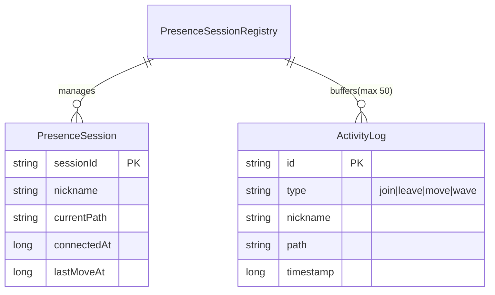

# 백엔드 포트폴리오 사이트 웹 기획서

> 작성일: 2026-04-21 | 버전: 1.0 | 대상: YAPP 지원용

---

## 1. 서비스 개요

### 목적

"설명하지 않고 동작으로 증명하는" YAPP 지원용 백엔드 포트폴리오 사이트.

정적인 경력 나열 대신, **사이트 자체가 곧 기술 데모**다.
- 접속 순간 터미널이 살아 움직이며(SSE) 개발자의 서사를 전달한다.
- 지금 이 순간 같은 화면을 보고 있는 다른 방문자의 존재(WebSocket)를 실시간으로 드러내며 "진짜 서버가 돌고 있다"는 사실을 즉각 증명한다.

### 대상 사용자

1. **YAPP 운영진/서류 심사자** — 짧은 시간 안에 기술적 깊이와 열정을 판단해야 하는 사람
2. **YAPP 동료 지원자/커뮤니티 멤버** — 협업 가능성과 기술 문화 적합도를 가늠하는 잠재적 동료
3. **지원자 본인** — 향후 채용/협업 상황에서 재사용 가능한 개인 브랜딩 자산

### 핵심 가치

1. **보여주지 말고 증명하라** — 백엔드 역량을 글로 설명하지 않고, 사이트 동작(SSE/WebSocket)으로 직접 시연한다.
2. **현재형 포트폴리오** — 지금 이 순간 서버가 돌고 있고, 다른 방문자가 함께 있다는 것을 느끼게 한다.
3. **감정이 담긴 기술** — 터미널 CRT 테마와 YAPP 지원 메시지로 기술적 완성도와 커뮤니티를 향한 애정을 동시에 전달한다.

---

## 2. 기능 목록 (MoSCoW)

### Must Have

| ID | 기능 | 설명 |
|----|------|------|
| M1 | 터미널 인트로 타이핑 | 접속 시 SSE로 자기소개 텍스트가 한 글자씩 스트리밍 |
| M2 | 실시간 방문자 현황 | WebSocket으로 현재 접속자 닉네임·경로를 실시간 표시 |
| M3 | 프로젝트 목록/상세 | 문제-해결-결과 구조로 3개 프로젝트 기술 |
| M4 | 기술 스택 | 영역별 스택과 숙련도 표시 |
| M5 | YAPP 지원 메시지 | 지원 동기와 애정을 담은 전용 섹션 |
| M6 | 터미널 CRT UI | CRT 모니터 테마(초록/흰색, monospace) 전체 적용 |

### Should Have

| ID | 기능 |
|----|------|
| S1 | 명령어 기반 네비게이션 (`cd`, `ls`, `cat`) |
| S2 | 방문자 닉네임 자동 할당 (`visitor_N`) |
| S3 | 타이핑 스킵 (아무 키) |
| S4 | 접속 로그 히스토리 |
| S5 | 모바일 반응형 |

### Could Have

| ID | 기능 |
|----|------|
| C1 | `wave` 명령어 — 전체 방문자에게 ASCII 인사 이펙트 | (이번 범위 제외, 추후) |
| C2 | 이스터에그 (`sudo hire-me`, `whoami`, `uptime`) | (이번 범위 제외, 추후) |
| C4 | 프로젝트별 ASCII 아키텍처 다이어그램 | (이번 범위 제외, 추후) |

### Won't Have

방문자 회원가입/로그인, 댓글, 방명록 DB 저장, 관리자 콘솔, 결제/연락 폼 서버 저장

---

## 3. 정보 구조 (사이트맵)

```
/ (루트 — CRT 부팅 화면)
│
├── /intro              [M1] SSE 타이핑 인트로
├── /live               [M2] 실시간 방문자 현황
├── /projects           [M3] 프로젝트 목록
│   ├── /projects/zendesk-websocket
│   ├── /projects/redis-shedlock
│   └── /projects/ai-harness
├── /stack              [M4] 기술 스택
├── /yapp               [M5] YAPP 지원 메시지
└── /contact            이메일/GitHub (정적)
```

SPA 앵커 섹션 구조. URL은 `history.replaceState`로 갱신 (IntersectionObserver 기반).

---

## 4. 사용자 플로우

```mermaid
flowchart TD
    A([랜딩: / 접속]) --> B[BootSequence 연출 ~1.2s]
    B --> C[/intro — SSE 타이핑 인트로]
    C -->|타이핑 완료 or Skip| D[/live — 실시간 방문자 현황]
    D --> E[/projects — 프로젝트 목록]
    E --> E1[/projects/zendesk-websocket]
    E --> E2[/projects/redis-shedlock]
    E --> E3[/projects/ai-harness]
    E1 & E2 & E3 --> F[/stack — 기술 스택]
    F --> G[/yapp — 지원 메시지]
    G --> H[/contact]

    subgraph 상시_동작
        WS[WebSocket 세션\n방문자 닉네임 할당·경로 브로드캐스트]
        CMD[CommandPrompt\ncd, ls, cat, wave, whoami...]
    end

    C -. ws:join .-> WS
    D <-. ws:presence .-> WS
    CMD -.명령어 파싱.-> C & E & G

    D -.네트워크 단절.-> X[[StatusBar: DISCONNECTED\n자동 재연결]]
    X -.복구.-> D
```

---

## 5. 화면 설계

### 5.0 공통 레이아웃

```
┌──────────────────────────────────────────────────────────────────────┐
│  TopBar: visitor_8@portfolio:~$ <path>          [LIVE] 3 online  [?] │  ← GlobalHeader (sticky)
├──────────────────────────────────────────────────────────────────────┤
│  [ SideNav ]  │  [ Section Content ]                                 │
│  ~/intro      │                                                      │
│  ~/live       │                                                      │
│  ~/projects   │                                                      │
│  ~/stack      │                                                      │
│  ~/yapp       │                                                      │
│  ~/contact    │                                                      │
├──────────────────────────────────────────────────────────────────────┤
│  StatusBar: uptime 14d 03:22 | ws:OK | last: visitor_5 → /projects  │  ← GlobalFooter (sticky)
├──────────────────────────────────────────────────────────────────────┤
│  $ _                                                      [history]  │  ← CommandPrompt (sticky)
└──────────────────────────────────────────────────────────────────────┘
```

**공통 컴포넌트:**
- `GlobalHeader` — 닉네임 프롬프트 + LIVE 배지 + WebSocket 상태
- `GlobalFooter` — uptime + ws 상태 + 최근 활동 로그 1건
- `CommandPrompt` — 터미널 입력창 (S1)
- `SideNav` — 데스크탑 좌측 앵커 네비 (≤768px 숨김)

**CRT 컬러 팔레트:**

| 변수 | 값 | 용도 |
|------|----|------|
| `--crt-bg` | `#0A0F0A` | 배경 |
| `--crt-green` | `#33FF66` | 주 텍스트/프롬프트 |
| `--crt-green-dim` | `#1F9A3D` | 보조 텍스트 |
| `--crt-white` | `#E6FFE6` | 강조 텍스트 |
| `--crt-amber` | `#FFB000` | LIVE 배지/경고 |
| `--crt-red` | `#FF5555` | DISCONNECTED |

---

### 5.1 부팅 화면 `/`

- **진입:** 최초 접속 (sessionStorage `booted` 플래그 없음)
- **컴포넌트:** `BootSequence` — 순차 로그 출력 (~1.2s), 아무 키로 스킵
- **다음:** 자동으로 `/intro`

```
[    0.00] CRT POWER ON
[    0.12] MemTest.................OK
[    0.34] Connecting to portfolio.api..........OK
[    0.71] Assigning nickname: visitor_8
[    1.02] Opening WebSocket /ws/presence........OK
[    1.15] Boot complete. Press any key.
```

---

### 5.2 인트로 `/intro` ★ SSE

- **컴포넌트:** `TypingStream` (SSE 구독), `Caret`, `SkipHint`
- **엔드포인트:** `GET /api/intro/stream` (`text/event-stream`)
- **이벤트:** `token → newline → done`
- **스킵:** 아무 키 → SSE close → 전체 텍스트 즉시 렌더 → `/live` 스크롤

```
┌──────────────────────────────────────────────────────────────────────┐
│ visitor_8@portfolio:~$ /intro                    [LIVE] 2 online [?] │
├──────────────────────────────────────────────────────────────────────┤
│  > whoami                                                            │
│  장민석 — Java/Spring Boot Backend Developer                         │
│                                                                      │
│  > cat about.txt                                                     │
│  SI 백엔드 개발자. 5년간 시스템을 만들었습니다.                      │
│  지금은 AI와 함께 더 많은 것을 더 빠르게 만들고 있습니다.           │
│                                                                      │
│  > echo $MOTIVATION                                                  │
│  설명하지 않고 동작으로 증명하는 개발자▌                            │
│                                      [ press any key to skip ▶ ]    │
├──────────────────────────────────────────────────────────────────────┤
│ uptime 1d 03h | sse:streaming | ws:OK                                │
└──────────────────────────────────────────────────────────────────────┘
```

---

### 5.3 방문자 현황 `/live` ★ WebSocket

- **컴포넌트:** `ConnectionBadge`, `PresenceTable`, `ActivityFeed`, `WaveFxLayer`
- **자동 갱신:** WebSocket `presence.*` 이벤트 수신 시 즉시 반영
- **wave:** `wave` 명령어 → 전체 방문자 화면에 ASCII 이펙트 2초

```
┌──────────────────────────────────────────────────────────────────────┐
│  ┌─ CONNECTION ──────────────────────────────────────────────────┐   │
│  │  [LIVE]  connected as visitor_8   since 00:02:14   38ms       │   │
│  └───────────────────────────────────────────────────────────────┘   │
│                                                                      │
│  ┌─ PRESENCE (3 online) ──────────────┐  ┌─ ACTIVITY ───────────┐   │
│  │ nickname     path            idle  │  │ visitor_5  join       │   │
│  │ ▶ visitor_8  /live          0s(me) │  │ visitor_5  → /prj     │   │
│  │   visitor_7  /projects/..   12s    │  │ visitor_7  → /stk     │   │
│  │   visitor_5  /projects       3s    │  │ visitor_8  join       │   │
│  └────────────────────────────────────┘  └──────────────────────┘   │
│                                                                      │
│  hint: type `wave` to say hi to everyone                             │
└──────────────────────────────────────────────────────────────────────┘
```

---

### 5.4 프로젝트 목록 `/projects`

```
$ ls /projects
drwxr-xr-x  zendesk-websocket/   Zendesk Rate Limit → WebSocket 전환
drwxr-xr-x  redis-shedlock/      분산 배치 중복 방지
drwxr-xr-x  ai-harness/          AI 생산성 시스템
```

**카드 구조 (×3):**
- `problem:` / `solution:` / `result:` 3행 요약
- `[ read more ↓ ]` → 상세 섹션 스크롤

---

### 5.5 프로젝트 상세 `/projects/{slug}`

zendesk-websocket 예시:

```
$ cat zendesk-websocket.md
# PRJ-01 · zendesk-websocket
period: 2023.02~2023.07   role: Backend   stack: [Java, Spring, WS, Redis]

## problem
  Zendesk REST API rate-limit으로 실시간 대시보드 지연 평균 8s.

## solution
  +----------+  WebSocket  +----------+  Webhook  +----------+
  |  Client  | <---------> |  Spring  | <-------- | Zendesk  |
  +----------+             |  Gateway |           +----------+
                           +----+-----+
                                | Redis Stream (backpressure)
                                v
                           +----------+
                           |  Worker  |
                           +----------+

## result
  latency p95   8.4s → 120ms
```

---

### 5.6 기술 스택 `/stack`

```
$ cat /stack/summary.txt

[Language]   Java ***   |  Kotlin *(이 프로젝트에서 시작)  |  TypeScript *
[Framework]  Spring Boot ***  |  Spring Batch **  |  JPA/Hibernate ***
[Data]       MySQL ***  |  Redis ***  |  PostgreSQL **  |  Oracle *
[Infra]      Docker **  |  AWS(EC2,S3,RDS) **  |  Nginx **  |  Vercel *
[Collab]     Git ***  |  Jira/Confluence ***  |  Obsidian **  |  Claude Code **

legend: *** fluent   ** production-ready   * learning
```

---

### 5.7 YAPP 지원 메시지 `/yapp`

- SSE로 타이핑 효과 재사용 (M1과 동일 컴포넌트)
- (`sudo hire-me` 이스터에그는 추후 구현)

```
$ cat /yapp/letter.md
From: visitor_8
To  : YAPP 운영진 귀하
Subj: 왜 YAPP인가
────────────────────────────────────────────────
  (본문: 지원 동기, 기여 의지 — 3~5 문단)
  ...
-- 장민석
   msjang.dev@gmail.com
$ cd ~
```

---

### 5.8 연결 끊김 오버레이 (에러 UX)

```
!! [DISCONNECTED] retrying (3)...                    [ retry now ]
(본문은 유지, WebSocket 의존 컴포넌트는 stale 표시)
```

재연결 성공 시 `ActivityFeed`에 `[RECONNECTED] as visitor_N` 자동 append.

---

### 5.9 반응형 정책

| 화면폭 | 변경 사항 |
|--------|----------|
| ≥1280px | 기본 80컬럼 + SideNav 표시 |
| 768–1279px | SideNav 숨김, 햄버거 메뉴 |
| <768px | 40컬럼, 카드/테이블 1단, ASCII 다이어그램 가로 스크롤 |

---

## 6. 기술 명세

### 6.1 기술 스택

| 영역 | 기술 | 선정 이유 |
|------|------|----------|
| Backend | Spring Boot 3.x + **Kotlin** | 이 프로젝트에서 Kotlin 찍먹. Java 상호운용 가능 |
| SSE | Spring MVC `SseEmitter` | 의존성 없음, 토큰 스트리밍 충분 |
| WebSocket | Spring WebSocket + STOMP over SockJS | SockJS 폴백, STOMP pub/sub 구조화 |
| Pub/Sub | In-memory `SimpMessagingTemplate` | 단일 인스턴스, 확장 시 Redis로 교체 가능 |
| Frontend | React + TypeScript + Vite | Vercel 배포 최적화 |
| Styling | Tailwind CSS + CSS Variables | CRT 컬러 팔레트 토큰 관리 |
| Deploy(FE) | Vercel (Hobby) | 무료, 자동 CI/CD |
| Deploy(BE) | 맥미니 + Docker + Nginx | 보유 인프라 활용, DDNS + Let's Encrypt |

---

### 6.2 시스템 아키텍처

```
           ┌───────────────────────────────────┐
           │          Vercel (Frontend)         │
           │  React SPA                         │
           │  EventSource(SSE) │ STOMP/SockJS   │
           └──────────┬────────┴────────┬───────┘
                      │ HTTPS/SSE       │ WSS
                      ▼                 ▼
           ┌───────────────────────────────────┐
           │       맥미니 홈 서버 (Backend)       │
           │  Spring Boot 3.x + Kotlin           │
           │                                    │
           │  SSE Controller    WebSocket        │
           │  /api/intro/stream /ws/presence     │
           │         │               │           │
           │         └───────┬───────┘           │
           │                 ▼                   │
           │  PresenceSessionRegistry            │
           │  (ConcurrentHashMap, 메모리 전용)   │
           └───────────────────────────────────┘
```

---

### 6.3 API 명세

#### `GET /api/meta`
```json
{ "uptimeMs": 1234567, "version": "1.0.0", "bootAt": "2026-04-21T09:00:00Z" }
```

#### `GET /api/intro/stream` — SSE
```
Content-Type: text/event-stream

event: token    data: {"t": "장"}
event: newline  data: {}
event: done     data: {"durationMs": 9200}
```
- 토큰 간 delay: 30~60ms / 줄 끝 정지: 500ms / emitter timeout: 30s

#### WebSocket `/ws/presence` — STOMP over SockJS

**서버 → 클라이언트 (`/topic/presence`):**

| event | payload |
|-------|---------|
| `session.assigned` | `{"nick":"visitor_8","sid":"abc"}` |
| `presence.snapshot` | `{"users":[...],"recentLogs":[...]}` |
| `presence.join/leave/move` | `{"nick","path"}` |
| `visitor.wave` | `{"from":"visitor_3"}` |
| `server.heartbeat` | `{"uptimeMs":1234567}` |

**클라이언트 → 서버:**

| destination | 트리거 |
|-------------|--------|
| `/app/presence/path` | IntersectionObserver 섹션 변경 |
| `/app/presence/wave` | `wave` 명령어 |
| `/app/presence/pong` | heartbeat 응답 |

Rate Limit: `wave` 5회/분 (세션 단위 서버 throttle)

---

### 6.4 데이터 모델

영속 DB 없음. 메모리 전용 런타임 객체.



서버 재시작 시 전체 초기화 (휘발성 의도적 유지).

---

## 7. 비기능 요건

### 성능
- SSE 동시 연결 100개 / WebSocket 동시 접속 50개 이하 (포트폴리오 특성)
- heartbeat 주기 10s (서버 idle 연결 유지)

### 보안
- Nickname: 서버가 UUID 앞 8자리로 할당, 클라이언트 변경 불가
- CORS: Vercel 배포 도메인만 허용
- `wave` rate limit: 세션당 5회/분
- 쓰기 엔드포인트 없음 (프로젝트 데이터 읽기 전용)

### 확장성
- 현재: 단일 인스턴스
- 수평 확장 시: `PresenceSessionRegistry`를 Redis Pub/Sub으로 교체 (인터페이스 분리로 준비)

---

## 8. 인프라 및 배포

| | Frontend | Backend |
|-|----------|---------|
| 플랫폼 | Vercel (Hobby) | 맥미니 홈 서버 |
| 도메인 | `*.vercel.app` | DDNS + Nginx |
| HTTPS/WSS | 자동 | Let's Encrypt (certbot) |
| 배포 방식 | GitHub push → 자동 빌드 | Docker 이미지 빌드 → `docker compose up -d` |

**Nginx WebSocket 필수 설정:**
```nginx
location /ws/ {
    proxy_pass http://localhost:8080;
    proxy_http_version 1.1;
    proxy_set_header Upgrade $http_upgrade;
    proxy_set_header Connection "upgrade";
}
```

**환경변수:**
- FE: `VITE_API_BASE_URL`, `VITE_WS_URL`
- BE: `.env` (맥미니 로컬, 외부 의존성 없음)

**로컬 개발:**
- BE: `./gradlew bootRun` (포트 8080)
- FE: `npm run dev` + Vite proxy (`/api`, `/ws` → localhost:8080)

---

## 9. 구현 순서 (바이브코딩 로드맵)

주말 1.5일 기준. Could Have는 이번 범위 제외.

| 순서 | 작업 | 예상 |
|------|------|------|
| 1 | Kotlin + Spring Boot 생성 + Docker 빌드 + 맥미니 배포 (Hello World) | 1시간 |
| 2 | WebSocket 세션 등록 + presence 이벤트 전체 | 2시간 |
| 3 | React 기본 레이아웃 + CRT CSS | 1시간 |
| 4 | `/live` — PresenceTable + ActivityFeed 연결 | 2시간 |
| 5 | SSE IntroScriptService + TypingStream 컴포넌트 | 2시간 |
| 6 | BootSequence + 정적 섹션 (projects, stack, yapp, contact) | 2시간 |
| 7 | CommandPrompt 명령어 파서 (`cd`, `ls`, `cat`) | 1시간 |
| 8 | WebSocket 재연결 로직 + DISCONNECTED 오버레이 | 1시간 |
| 9 | 모바일 반응형 + Nginx HTTPS 설정 + Vercel 연결 + 최종 검증 | 1.5시간 |

**총 예상: 약 13.5시간**

---

## 10. 사용자 시나리오

### 시나리오 1 — YAPP 심사자 (3분 컷)

1. 지원서 링크 클릭 → CRT 부팅 화면
2. `visitor_8@portfolio:~$` 프롬프트와 함께 자기소개 타이핑 시작 (SSE)
3. 화면 우상단 `[LIVE] 2 visitors` 배지 → "진짜 서버가 있구나" 각인
4. `/projects` 이동 시 본인 이동이 다른 심사자 화면에도 실시간 반영
5. Zendesk 프로젝트 → WebSocket 경험자가 포트폴리오도 WebSocket으로 구현했다는 연결 고리
6. `/yapp` 지원 메시지 읽고 마무리 → **기억에 남는 지원자**

### 시나리오 2 — 동료 지원자 발견

1. 커뮤니티에서 링크 공유받아 접속
2. `visitor_12, visitor_15` 이미 접속 중 → "이 사이트 자체가 데모구나" 인식
3. `ls /projects` 명령어 직접 입력해봄 (S1)
4. GitHub 따라가 코드 확인 → 슬랙에 공유 → **바이럴**

### 시나리오 3 — 연결 끊김/복구

1. 페이지 읽다가 네트워크 단절
2. 상단 `[DISCONNECTED] retrying...` 표시, PresenceTable stale
3. 재연결 → `[RECONNECTED] as visitor_8` 로그 append, 목록 복구
4. **복원력 있는 시스템** 체감

---

*(끝)*
